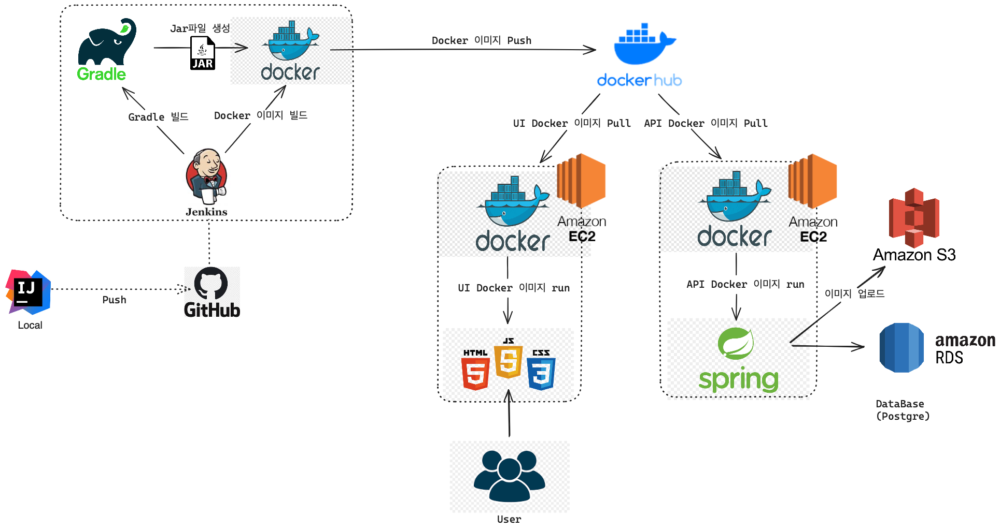
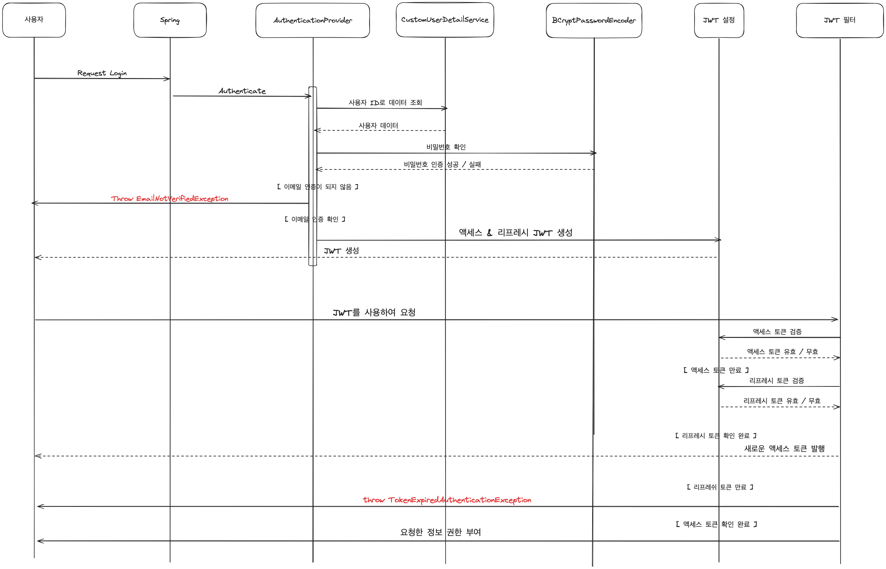
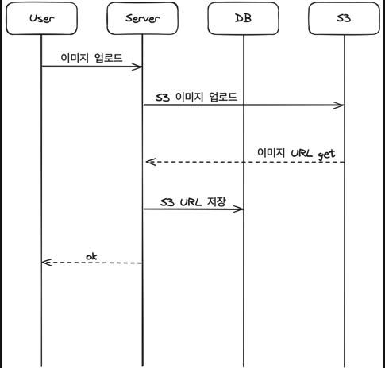
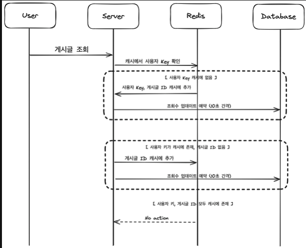
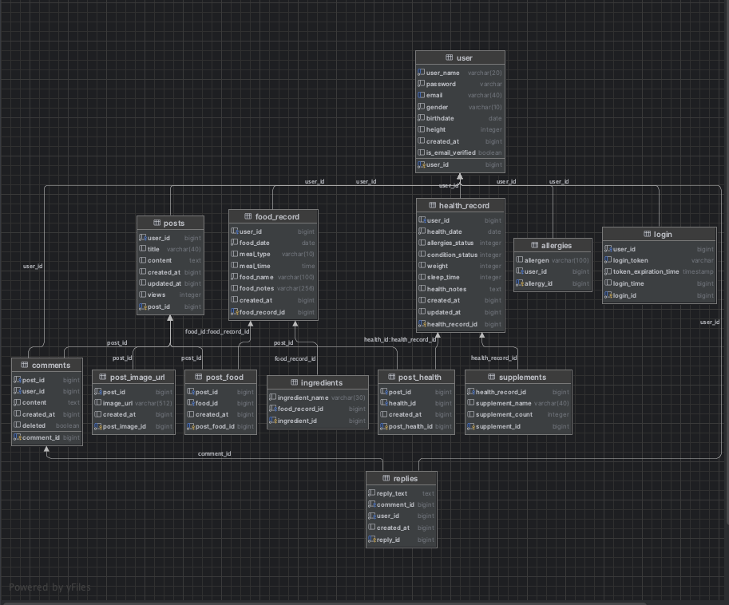

# 알러지 식단 관리 서비스

---

- 이 서비스는 다이어트와 알러지가 있는 사용자를 위한 식단 관리 플랫폼 입니다. 사용자는 자신의 알러지 정보와 원하는 날짜에 섭취한 음식 그 날의 건강 데이터를 기록할 수 있습니다.
- 체중이 늘거나 몸상태가 좋지 않을때 본인의 식단이나 건강 기록을 확인할 수 있습니다. 
- 체중 감소 실패나, 건강 악화 시 커뮤니티 탭을 통해 다른 이용자들과 경험을 공유하고 피드백을 받을 수 있습니다.

## 개발 환경

---
- Java17
- SpringBoot, JPA
- PostgreSQL
- AWS S3
- HTML, CSS, Bootstrap, JavaScript, jQuery
- Redis

## 배포 환경

---

## 주요 기능

### 1. 회원 관리
- **회원가입 및 로그인 기능**
- **이메일 인증**: 가입 시 제공된 이메일로 인증 링크를 보내 사용자의 이메일을 검증합니다.
- **보안 로그인 구현**: 스프링 시큐리티와 JWT를 사용하여 보안성 높은 로그인을 구현했습니다.

### 2. 식단 데이터 관리
- **식사 유형 및 시간 기록**: 사용자는 아침, 점심, 저녁 식사 시간과 유형을 기록할 수 있습니다.
- **음식명 및 원재료 리스트**: 섭취한 음식과 그 원재료를 기록, Open API를 활용하여 원재료에 대한 정보 제공.

### 3. 건강 데이터 관리
- **알러지 상태 기록**: 사용자의 알러지 정보를 상세히 기록하고 관리합니다.
- **일일 컨디션 수치 및 몸무게 기록**: 매일의 건강 상태와 몸무게를 기록하여 확인할 수 있습니다.

### 4. 커뮤니티 기능
- **게시글 작성 및 공유**: 커뮤니티 내에서 자신의 경험을 공유하고 다른 사용자와 소통할 수 있습니다.
- **음식 사진 업로드**: 식단과 관련된 사진을 AWS S3에 저장하여 게시글에 첨부할 수 있습니다.

## 주요 로직

---

### 스프링 시큐리티 + JWT

 

### S3 업로드 방식

 

### 게시글 조회수 업데이트 Redis 방식

## ERD

## 서비스 개선사항에 따른 보고서
https://gelatinous-sage-97e.notion.site/ad2a064606b34b89ad852d65a96a85ba?pvs=4**
