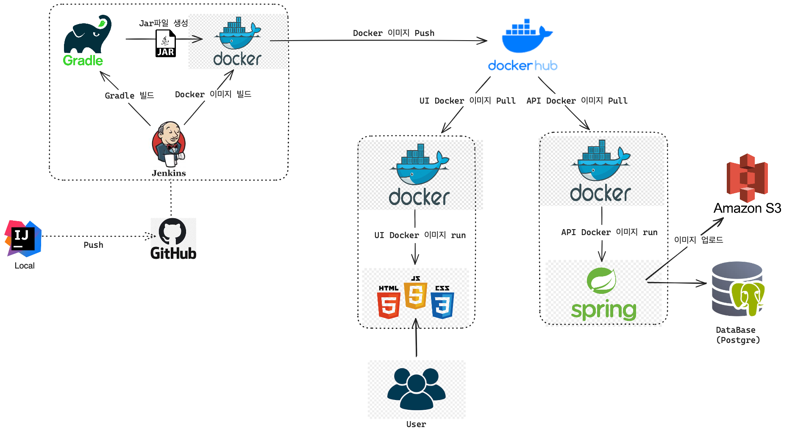

# 알러지 식단 관리 서비스

---

- 이 서비스는 다이어트와 알러지가 있는 사용자를 위한 식단 관리 플랫폼 입니다. 사용자는 자신의 알러지 정보와 원하는 날짜에 섭취한 음식 그 날의 건강 데이터를 기록할 수 있습니다.
- 체중이 늘거나 몸상태가 좋지 않을때 본인의 식단이나 건강 기록을 확인할 수 있습니다. 
- 체중 감소 실패나, 건강 악화 시 커뮤니티 탭을 통해 다른 이용자들과 경험을 공유하고 피드백을 받을 수 있습니다.

## 개발 환경

---
- Java17
- SpringBoot, JPA
- PostgreSQL
- AWS S3
- HTML, CSS, Bootstrap, JavaScript, jQuery
- Redis

## 배포 환경

---

## 주요 기능

---
### 1. 회원 관리
    - 회원가입 및 로그인 기능
    - 이메일을 통한 사용자의 메일 인증
    - 스프링 시큐리티와 JWT를 사용한 보안 로그인 구현
### 2. 식단 데이터 관리
    - 식사 유형, 시간, 음식명, 원재료 리스트, 특이사항 기록
    - Open API를 활용한 음식 원재료 정보 제공
### 3. 건강 데이터 관리
    - 알러지 상태, 일일 컨디션 수치, 몸무게, 수면시간, 복용 약 정보, 특이사항 기록
### 4. 커뮤니티 기능
    - 게시글 작성 및 공유, 게시글에 원하는 날짜의 식단 및 건강 데이터 선택 가능
    - 음식 사진 업로드 및 S3 저장

## 주요 로직

---

### 스프링 시큐리티 + JWT

 

### S3 업로드 방식

 

### 게시글 조회수 업데이트 Redis 방식

## ERD

## 서비스 개선사항에 따른 보고서
https://gelatinous-sage-97e.notion.site/ad2a064606b34b89ad852d65a96a85ba?pvs=4
